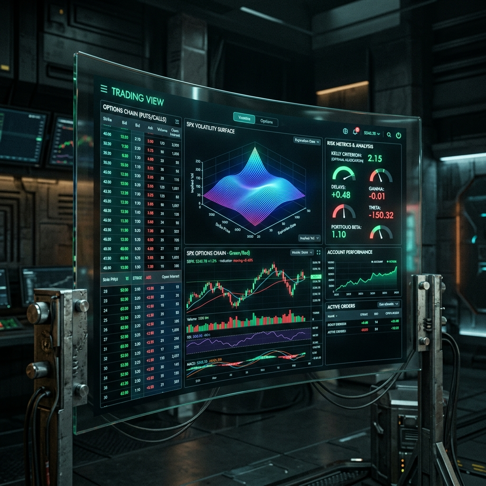
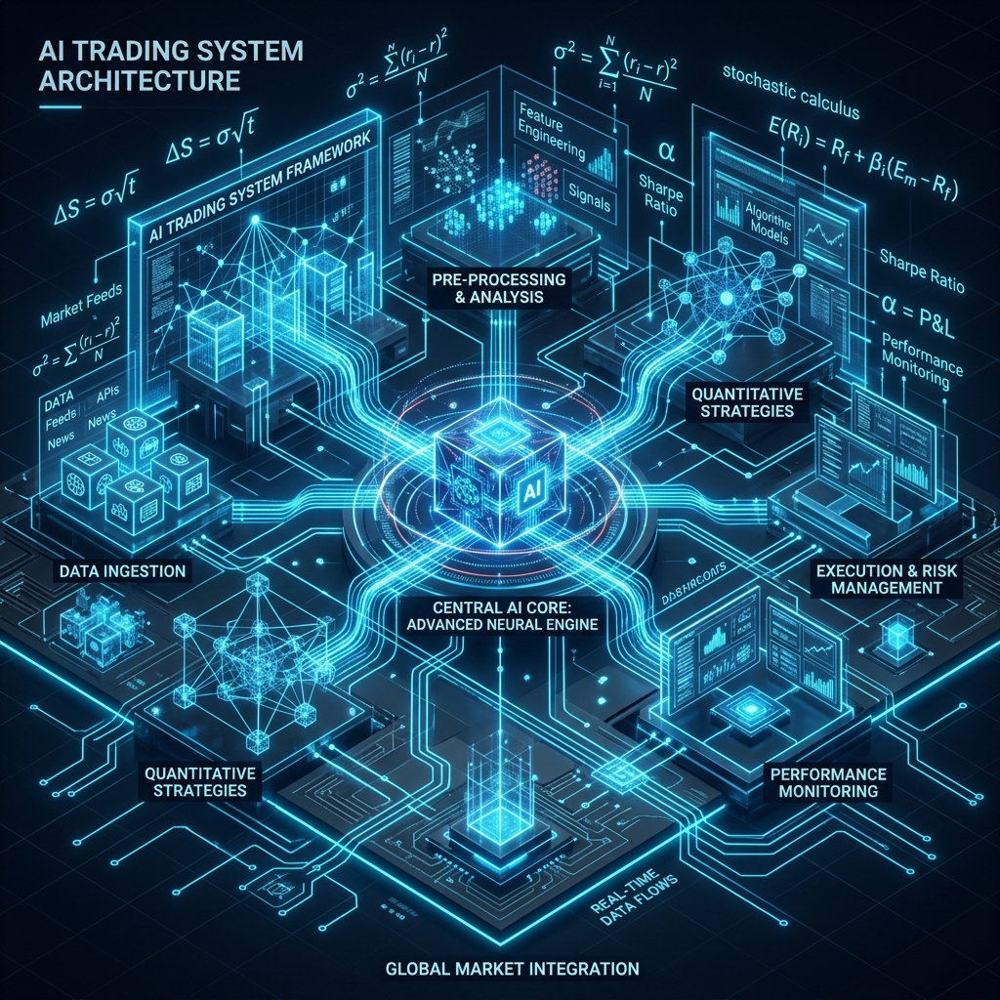
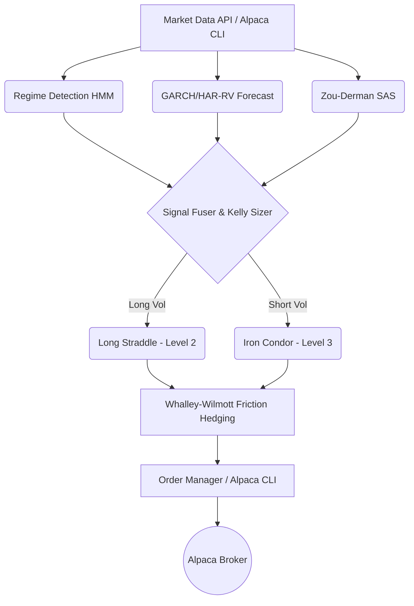

<div align="center">
  

  # Alpaca Volatility Agent 🦙📉
  
  **An autonomous options volatility-trading & hedging agent for Alpaca's paper trading environment.**
  
  *Built for the [Alpaca AI Trading Agents Hackathon](https://lablab.ai/ai-hackathons/alpaca-ai-trading-agents-hackathon)*

  [](https://opensource.org/licenses/MIT)
  [](https://www.python.org/downloads/)
  [](https://alpaca.markets/docs/)
</div>

---

## ⚡ The Elevator Pitch

**Alpaca Vol Agent** is an autonomous, quantitative options trading system that harvests volatility risk premium (VRP). It fuses a regime-conditional HMM, GARCH/HAR-RV forecasting, and Kelly sizing with rigorous transaction-cost-aware hedging—all executing seamlessly through Alpaca's official CLI. 

This isn't just an LLM making random guesses. It's a mathematically grounded **Volatility-Harvesting Agent** combined with a **Portfolio Hedge Overlay**, representing the pinnacle of "Options Alpha" for this hackathon.

---

## 🌪️ The Problem & The Solution

**The Problem:** Most AI trading agents are either "black boxes" blindly firing API requests or lack a true mathematical edge, ignoring critical constraints like transaction costs, portfolio greeks, and broker-specific options levels.

**The Solution:**
Our agent reads real implied volatility directly off Alpaca's live chain, cross-validates it using an independent, purely historical signal (Zou-Derman Strike-Adjusted Spread), and executes fractional-Kelly sized Iron Condors or Straddles. Every trade is delta-hedged using a min-variance ratio with Whalley-Wilmott no-trade bands to prevent bleeding out to spread and slippage.

<div align="center">
  
  <p><em>Immersive Dashboard Tracking Live Option Chains & Model Decision Trails</em></p>
</div>

---

## 🧠 Core Alpha Architecture

<div align="center">
  
</div>

Our architecture represents a sophisticated pipeline, not a simple heuristic:



### 1. Regime-Conditional HMM
4-state Hidden Markov Model regime detection (Range, Trend, Vol_Expansion, Crash).

### 2. Live VRP & Volatility Forecasting
GARCH(1,1) + HAR-RV blended forecast checked against live implied volatility read straight from Alpaca's option chain.

### 3. Rigorous Hedging & Sizing
Fractional-Kelly risk budget with gamma/vega capped limits. Re-sizes dynamically based on the current book's actual risk.

---

## 🛡️ Tooling Compliance (READ THIS)

**The playbook requires using Alpaca's MCP server or CLI.** 
This project strictly routes **every** Alpaca call through `subprocess.run(["alpaca", "api", METHOD, path, ...])`. 

We use the official CLI's raw escape hatch (`alpaca api METHOD <path>`). Nothing here calls `requests` or `alpaca-py` directly for trading. This ensures robust tooling compliance while maintaining the lightning-fast execution required for options delta hedging.

*(See the `OLD_README.md` for our extended writeup on Alpaca Trading Level Constraints).*

---

## 🚀 Quickstart Guide

### 1. Setup your Environment
Create a **NEW** paper account at [Alpaca](https://app.alpaca.markets).
Install the Alpaca CLI (Required for Tooling Compliance):
```bash
go install github.com/alpacahq/cli/cmd/alpaca@latest
alpaca version
```

### 2. Configure Credentials
```bash
export ALPACA_API_KEY=PK...
export ALPACA_SECRET_KEY=...
alpaca account get --quiet
```

### 3. Install Python Dependencies
```bash
git clone https://github.com/WoLfy15/ALPACA-VOL-AGENT.git "Alpaca Trading"
cd "Alpaca Trading"
pip install -r requirements.txt
cp .env.example .env
```

### 4. Run the Agent (Dry-Run Mode)
Computes everything (regime, forecast vol, SAS, sizing) without submitting real orders.
```bash
python cli.py run --once
```

### 5. Go Live (Paper Trading)
Ready to dominate? Start the live loop:
```bash
python cli.py run --loop --interval 900 --live
```

### 6. Launch the Dashboard Backend
```bash
python cli.py serve --port 8000
```

---

## 🔮 Future Roadmap

- **RL Execution Extension:** Integrating a PPO execution agent trained on a synthetic Hawkes limit-order-book simulator to optimize order routing.
- **Rough Volatility Surface Calibrator:** Adding a PyTorch neural rough-Bergomi surface calibrator for even deeper options pricing insights.

---

*For deep, extensive technical details on the underlying math, please reference `OLD_README.md`.*

<div align="center">
  <sub>Built with ❤️ and Math for the Alpaca AI Hackathon. Let's win this.</sub>
</div>
